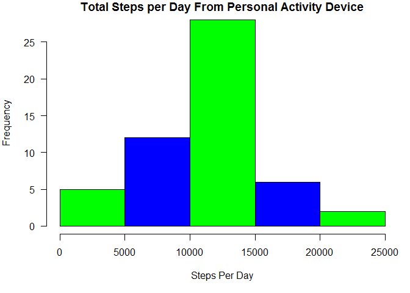
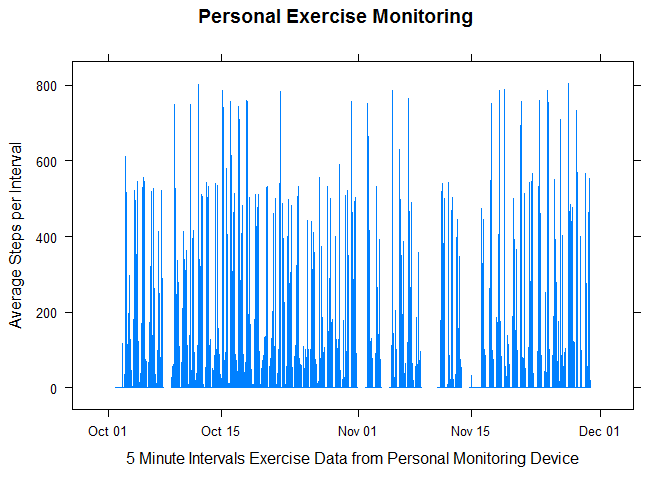
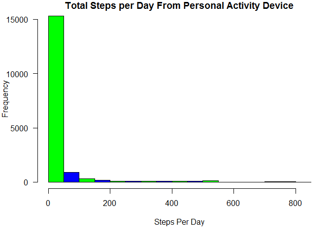
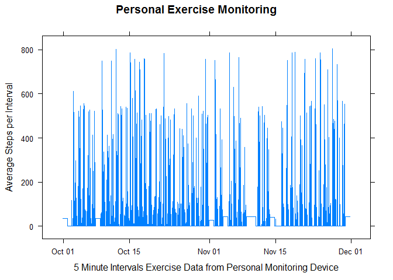
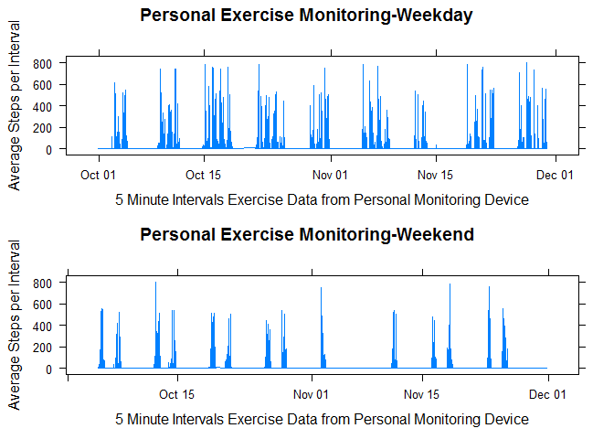

Introduction
========================================================================================================

```r
library(knitr)
opts_chunk$set(echo=TRUE)
```
##### Project Overview
The goal for this project was to analyze the activity dataset to understand the patterns and frequency of activity as measuresd by steps on a personal exercise monitoring device which measured steps in 5 minute intervals over atwp month period.   Frequency was examined via histogram plots and patterns via line graphs.  The data was analyzed including missing values as well as filling missing values with means and modes of data.  

##### Dataset Overview
* This project uses the activity monitoring dataset.  
* The native URL for this dataset is https://d396qusza40orc.cloudfront.net/repdata%2Fdata%2Factivity.zip. However a zip file of this data set has also been forked to this GitHub directory.  
* The variables in the dataset are:
+ steps: Number of steps taking in a 5-minute interval (missing values are coded as NA)
+ date: The date on which the measurement was taken in YYYY-MM-DD format
+ interval: Identifier for the 5-minute interval in which measurement was taken
* The dataset is stored in a comma-separated-value (CSV) file and there are a total of 17,568 observations in this dataset.  


```r
## Set the working directory, download the file and look at the data
## setwd( "C:/Alison/R/R Working Directory")
## temp <-tempfile()
## download.file("https://d396qusza40orc.cloudfront.net/repdata%2Fdata%2Factivity.zip",temp)

## exerData <- read.csv(unz(temp,"activity.csv" ))
## unlink(temp)
```
This is the code that was implemented to unzip the file on Github to address working directory issue.


```r
unzip("activity.zip")
exerData <- read.csv("activity.csv")
```
#### Part one - looking at the data including missing values and draw a histogram of steps per day and plot average steps per interval over 5 minutes intervals over a two month period.  

##### 1. The first step was to calculate the steps per day and then plot those on a histogram.  

```r
## Calculate Steps per Day
    stepsPerDay<-aggregate(exerData$steps, by=list(exerData$date), FUN=sum)
    colnames(stepsPerDay) <- c("ExerDate","StepsTotal")

## Draw Histogram
    TotalSteps <- stepsPerDay$StepsTotal
    colors=c("green", "blue")
```
###### Here is a histogram of the data:  

```r
    par(mar = c(5,4,1,1),las=1)
    hist(TotalSteps, col=colors, main="Total Steps per Day From Personal Activity Device",xlab="Steps Per Day")
```

 

#####  2. The next step was to calculate the mean and median for the steps per day.  

```r
    ## Calculate mean and median for TotalSteps
    StepsMean <- mean(TotalSteps,na.rm=TRUE)
    StepsMedian <- median(TotalSteps,na.rm=TRUE)
```
The mean was found to be:  
1.0766189\times 10^{4}

The median was found to be:  
10765

##### 3. The next step was to plot the average steps per interval over the 5 minute variables.  
To do this required the parsing out of the intervals into hours and minutes and then merging them with the date
to get a date-interval.   

```r
## Convert Date and Interval to YYYY-MM-DD HH:SS
    library(dplyr)
```

```
## 
## Attaching package: 'dplyr'
## 
## The following object is masked from 'package:stats':
## 
##     filter
## 
## The following objects are masked from 'package:base':
## 
##     intersect, setdiff, setequal, union
```

```r
    library(lubridate)
    exerData1 <- mutate(exerData, Hour = interval %/% 100, Minute = interval %% 100)  
    ## rm(exerData)
    exerData2 <-transform(exerData1,NewDate=paste0(date," ",Hour,":",Minute,":","00"))
    library(lubridate)
    exerData2$NewDate <- ymd_hms(exerData2$NewDate)
    ## Calculate Average steps per time interval
    AvgStepsPerInterval<-aggregate(exerData2$steps, by=list(exerData2$NewDate),FUN=mean)
    ## Give new Headers
    colnames(AvgStepsPerInterval) <- c("dateExer","AverageSteps")
## Plot the 5 minute time interval
    library(lattice)
```
###### This is a plot of the average steps per interval over the two month time period:  

```r
    par(mar = c(5,4,1,1),las=1)
    xyplot (AverageSteps ~ dateExer, data=AvgStepsPerInterval,type="l",  xlab = "5 Minute Intervals Exercise Data from Personal Monitoring Device", ylab = "Average Steps per Interval", main = "Personal Exercise Monitoring")
```

 

##### 4. The next step was to determine the interval with the maximum number of steps.  

```r
##  Determine Interval with the Maxiumum number of steps
    Sorted<- exerData2[order(-exerData2$steps,na.last=NA),]
    MaxSteps <-(Sorted[1,6])
```
###### This maximum interval was found to be:

 2012-11-27 06:15:00

#### Part 2: Addressing missing values.  Two methods were undertaken to address the missing values in the data(Steps column with NA values): one by filling with the means steps by days of the week and the other by filling with the mode of all step data.  
##### 5. The next step was to look at the missing values.  


```r
## Determine number of rows with NA
    NARows <- (is.na(exerData2[1]))
    NArowCount<-sum(NARows)
```
###### The number of rows with missing values was found to be:  
2304

The instructions were to attempt to fill the missing values and the examples given were to try filling with the meefor day and mean for interval.   These were attempted and were found to still leave some NAs in the data and the intructions were to remove all NAs from the data.  

So the next attempt was to calculate the mean number of steps for the week and then fill the missing (NA) values with those days so that for example all missing values on Monday would be filled with the mean number of steps for Mondays. 

##### Missing values filled with means of intervals by days of the week.  

```r
##   Fill missing values with mean of day of week. Attempted mean for day and mean for interval as suggested but all resulted in NAs remaining in the day
##   And the insructions were to fill in in all of the missing values.
    
##   Give Names to Days of Week
    exerData3<- mutate (exerData2, DayofWeek= wday(NewDate, label=TRUE))
## rm(exerData2)
## Remove extraneous columns
    exerData4 <- exerData3[c(-2,-3,-4,-5)]
## rm(exerData3)
    colnames(exerData4) <- c("Steps","dateExer","DayofWeek")
## Calculate median steps per day of Week
    AvgStepsDayWeek<-aggregate(exerData4$Steps, by=list(exerData4$DayofWeek),FUN=mean,na.rm=TRUE)
    colnames(AvgStepsDayWeek) <- c("DayofWeek","Steps")

## Split file into sets with and without NA and rejoin
    NAinExerData<- subset(exerData4, is.na(exerData4$Steps))
    NONAinExerData<- subset(exerData4, !is.na(exerData4$Steps))
    FillNAinExerData <- merge(AvgStepsDayWeek,NAinExerData, by="DayofWeek")
    FillNAinExerData$Steps.y <- FillNAinExerData$Steps.x
    GoodData <- FillNAinExerData[c(2,4,1)]
    colnames(GoodData) <- c("Steps","dateExer","DayofWeek")
    FinalData <-rbind(GoodData,NONAinExerData)
```
##### 6. The next step was to draw a histogram on this new dataset.  

```r
## Draw a histogram of the dataset where the NAs are filled by means of days of week    
    stepsPerDay<-aggregate(FinalData$Steps, by=list(FinalData$dateExer), FUN=sum)
    colnames(stepsPerDay) <- c("ExerDate","StepsTotal")
## Draw the Histogram
    TotalSteps <- stepsPerDay$StepsTotal
    colors=c("green", "blue")
```
The following is a histogram of the steps per day with the missing values filled by the means of the steps for the days of the week. 

```r
    par(mar = c(5,4,1,1),las=1)
    hist(TotalSteps, col=colors, main="Total Steps per Day From Personal Activity Device",xlab="Steps Per Day")
```

 


Filling the missing data with the means of the days of the week highlighted the fact that most days had an average of close to steps at all.

##### 7. The next step was to calculate the mean and median for steps per day for this new dataset.   

```r
    StepsMean2 <- mean(TotalSteps)
    StepsMedian2 <- median(TotalSteps)
```
###### The mean for the data with the missing filled with the means for the day of the week was found to be:  
37.5736445

###### The median for the data with the missing filled with the means for the day of the week was found to be:  
0

##### 8. The next step was to plot the average steps per interval using this missing-filled dataset.  

```r
## Calculate Average steps per time interval
    AvgStepsPerInterval2<-aggregate(FinalData$Steps, by=list(FinalData$dateExer),FUN=mean)
## Give new Headers
    colnames(AvgStepsPerInterval2) <- c("dateExer","AverageSteps")
    
## Plot the 5 minute time interval
    library(lattice)
```
###### The following is a plot of the average steps per interval using this filled missing values dataset.  

```r
    par(mar = c(5,4,1,1),las=1)
    xyplot (AverageSteps ~ dateExer, data=AvgStepsPerInterval2,type="l",  xlab = "5 Minute Intervals Exercise Data from Personal Monitoring Device", ylab = "Average Steps per Interval", main = "Personal Exercise Monitoring")
```

 

```r
##
```
##### The next step was to see the effect of weekends versus weekdays on the data.  
As this data had been analyzed and used in the prior missing values dataset, that dataset was cleared and a new missing values dataset created. The average steps per weekday used in the prior data filling exercise can be seen in the following table:

```r
library(xtable)
xt <- xtable(AvgStepsDayWeek)
print (xt, type = "html")
```

<!-- html table generated in R 3.2.0 by xtable 1.7-4 package -->
<!-- Sat May 16 18:17:07 2015 -->
<table border=1>
<tr> <th>  </th> <th> DayofWeek </th> <th> Steps </th>  </tr>
  <tr> <td align="right"> 1 </td> <td> Sun </td> <td align="right"> 42.63 </td> </tr>
  <tr> <td align="right"> 2 </td> <td> Mon </td> <td align="right"> 34.63 </td> </tr>
  <tr> <td align="right"> 3 </td> <td> Tues </td> <td align="right"> 31.07 </td> </tr>
  <tr> <td align="right"> 4 </td> <td> Wed </td> <td align="right"> 40.94 </td> </tr>
  <tr> <td align="right"> 5 </td> <td> Thurs </td> <td align="right"> 28.52 </td> </tr>
  <tr> <td align="right"> 6 </td> <td> Fri </td> <td align="right"> 42.92 </td> </tr>
  <tr> <td align="right"> 7 </td> <td> Sat </td> <td align="right"> 43.53 </td> </tr>
   </table>


###### Filling in missing values with the mode.  
So the next attempt to fill the missing values was to try and find the mode for the values in the Steps column once the missing values were removed.  The mode was found to be zero, so the missing values were then filled with zeros.


```r
## Start file from beginning using mode of all steps
library(modeest)
```

```
## 
## This is package 'modeest' written by P. PONCET.
## For a complete list of functions, use 'library(help = "modeest")' or 'help.start()'.
```

```r
NONAinExerData2<- subset(exerData2, !is.na(exerData2$steps))
ModeSteps<-mlv(NONAinExerData2$steps, method = "mfv")
## Determine that mode for all steps when NA are removed is 0
## Set all NA in Steps in file to zero
    exerDataFill <- exerData2
    exerDataFill[is.na(exerDataFill)] <- 0
```
######  The next step was to add a new column for days of the week and then process that so that Monday to Friday were coded as weekdays and Saturday and Sunday were coded as weekends.  


```r
##  Add Day of week column to file
    exerDataFill<- mutate (exerDataFill, DayofWeek= wday(NewDate))
    exerDataFill$DayofWeek[exerDataFill$DayofWeek==1] <- "Weekend"
    exerDataFill$DayofWeek[exerDataFill$DayofWeek==2] <- "Weekday"
    exerDataFill$DayofWeek[exerDataFill$DayofWeek==3] <- "Weekday"
    exerDataFill$DayofWeek[exerDataFill$DayofWeek==4] <- "Weekday"
    exerDataFill$DayofWeek[exerDataFill$DayofWeek==5] <- "Weekday"
    exerDataFill$DayofWeek[exerDataFill$DayofWeek==6] <- "Weekend"
```
###### The next step as was to calculate average steps per weekend days and average step for weekdays.  

```r
    Weekdays<-subset(exerDataFill, DayofWeek=="Weekday")
    Weekend<-subset(exerDataFill, DayofWeek=="Weekend")      
    AvgStepsWeekday<-aggregate(Weekdays$steps, by=list(Weekdays$NewDate),FUN=mean)
    AvgStepsWeekend<-aggregate(Weekend$steps, by=list(Weekend$NewDate),FUN=mean)
    ## Give new Headers
    colnames(AvgStepsWeekend) <- c("Interval","AverageSteps")
    colnames(AvgStepsWeekday) <- c("Interval","AverageSteps")
```
###### The last step was to plot this data by weekdays versus weekend days.  

```r
## Create Graphs
    require(gridExtra)
```

```
## Loading required package: gridExtra
## Loading required package: grid
```

```r
    p1<- xyplot (AverageSteps ~ Interval, data= AvgStepsWeekday,type="l",  xlab = "5 Minute Intervals Exercise Data from Personal Monitoring Device", ylab = "Average Steps per Interval", main = "Personal Exercise Monitoring-Weekday")
    
    p2<- xyplot (AverageSteps ~ Interval, data= AvgStepsWeekend,type="l",  xlab = "5 Minute Intervals Exercise Data from Personal Monitoring Device", ylab = "Average Steps per Interval", main = "Personal Exercise Monitoring-Weekend")
   
    library(gridExtra)
```
###### The following is a set of plots that compare weekday versus weekend exercise frequency (Average Steps per interval) as measured by a person ### exercise monitoring device over 5 minute intervals:  

```r
    par(mar = c(2,2,2,2),las=1)
    grid.arrange(p1,p2, nrow = 2)
```

 
